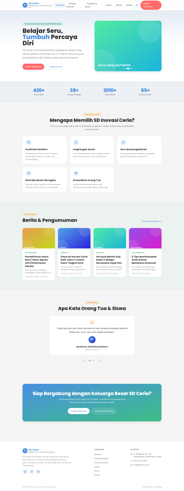
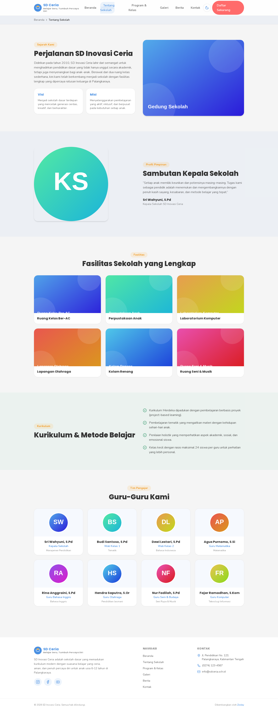
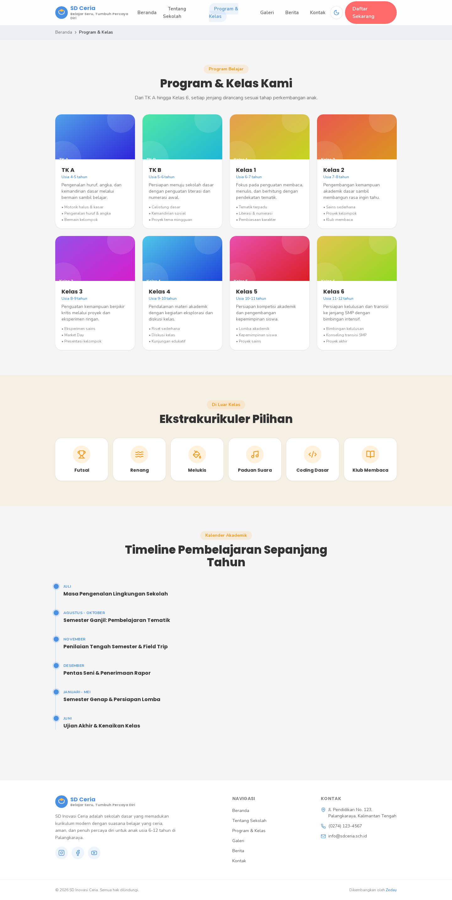
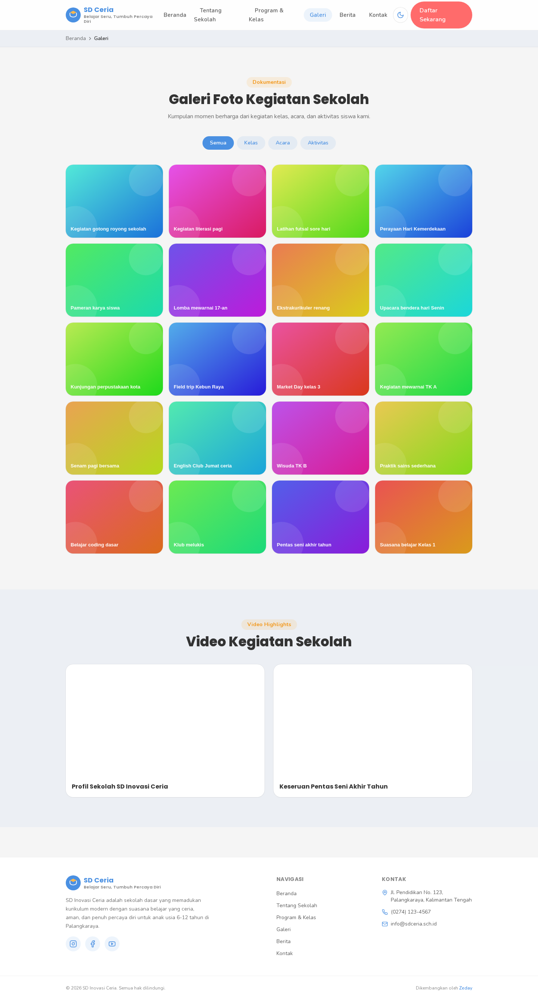
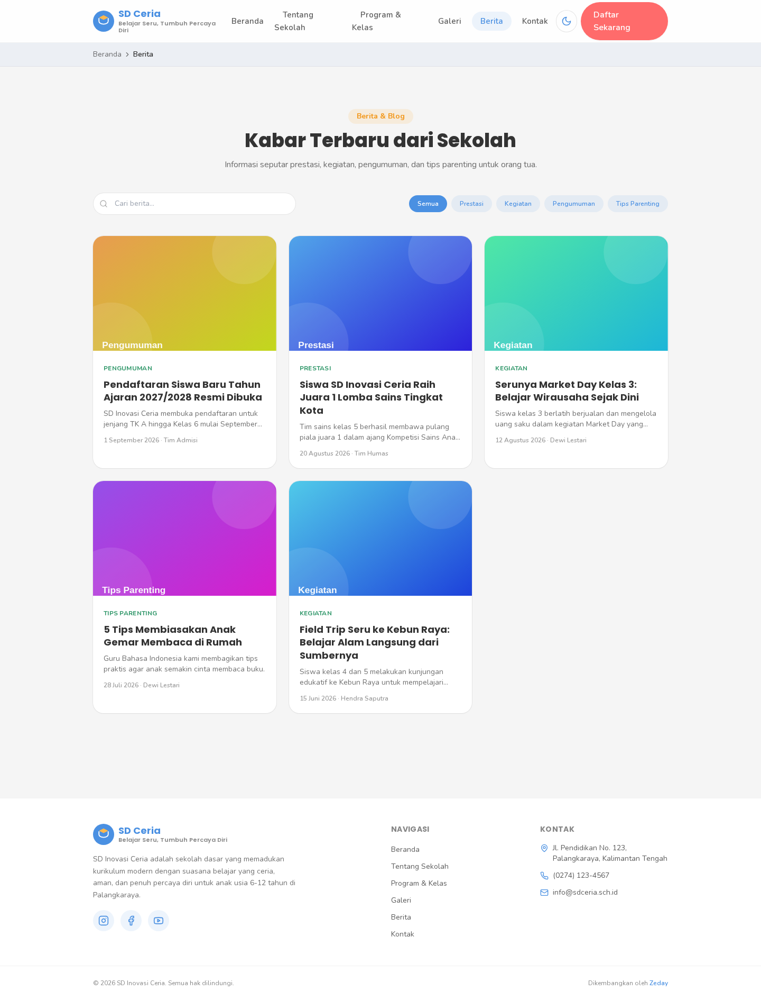
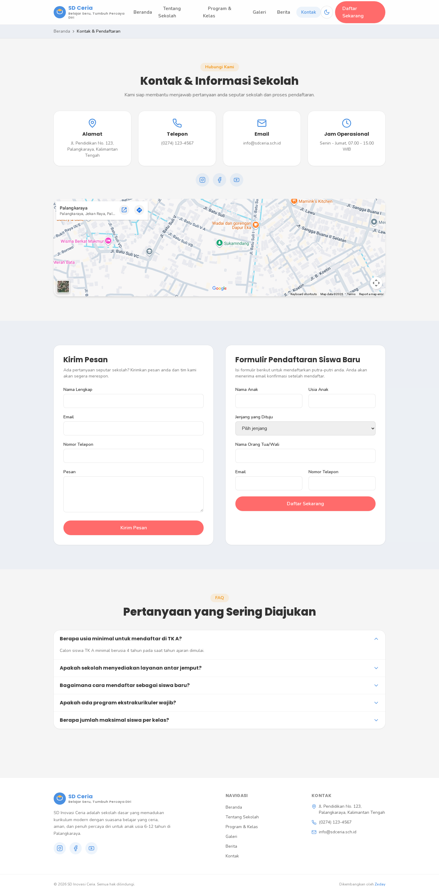
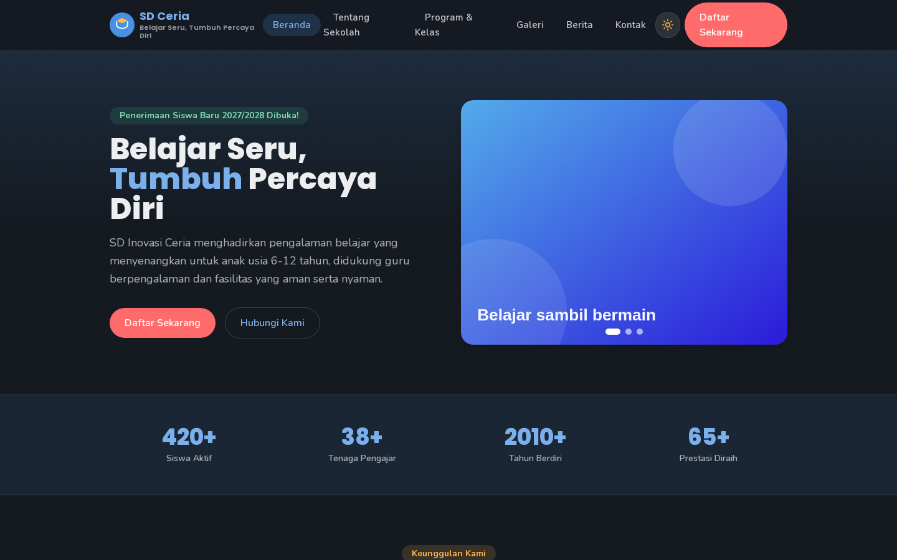
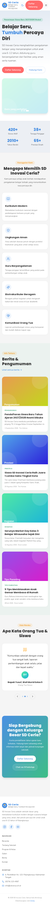

# SD Inovasi Ceria — Website Sekolah

Website resmi SD Inovasi Ceria: "Belajar Seru, Tumbuh Percaya Diri".
Dibangun dengan Next.js 16 (App Router), React 18, TailwindCSS, dan
SQLite sebagai CMS ringan yang bisa dikelola penuh lewat panel admin.

Dikembangkan oleh **Zeday** — [https://join.co.id](https://join.co.id)

> Contoh live (data & sekolah di bawah ini masih dummy/contoh): [sd.join.co.id](https://sd.join.co.id)

## Preview

| Beranda | Tentang Sekolah |
| --- | --- |
|  |  |

| Program & Kelas | Galeri |
| --- | --- |
|  |  |

| Berita | Kontak & Pendaftaran |
| --- | --- |
|  |  |

| Dark Mode | Tampilan Mobile |
| --- | --- |
|  |  |

## Fitur Utama

- Halaman: Beranda, Tentang Sekolah, Program & Kelas, Galeri, Berita/Blog, Kontak & Pendaftaran.
- **Panel admin dengan CMS penuh** (`/admin`): kelola Berita, Galeri, Guru, Program, dan lihat/atur status Pendaftaran siswa baru — semua lewat form, tanpa perlu edit kode atau deploy ulang.
- Unggah gambar asli (JPG/PNG/WebP, maks 5MB) untuk berita, galeri, dan foto profil guru; otomatis memakai placeholder SVG bila belum ada foto.
- Dark mode toggle (default: light mode), fully responsive (mobile-first).
- **Pilihan bahasa** (Indonesia/English/日本語/中文) lewat dropdown di navbar — menerjemahkan UI (menu, tombol, label form, halaman Kontak, Kebijakan Privasi). Lihat bagian "Bahasa (i18n)" untuk detail cakupannya.
- SEO: metadata per halaman, Open Graph, JSON-LD, `sitemap.xml`, `robots.txt`, revalidasi otomatis saat konten admin berubah.
- Aksesibilitas: skip-to-content, label ARIA, kontras warna sesuai WCAG AA, navigasi keyboard.
- Form kontak & pendaftaran siswa baru dengan validasi real-time (React Hook Form + Zod), email konfirmasi (opsional, via SMTP), dan pendaftaran tersimpan permanen di database (bisa dilihat/dikelola admin meski email gagal terkirim).
- Galeri foto dengan filter kategori & lightbox, video YouTube embed.
- PWA dasar: manifest + service worker untuk caching offline halaman utama.
- Favicon/icon situs & tagline dapat diganti langsung dari panel admin.
- Test end-to-end otomatis (Playwright) dan pipeline CI (GitHub Actions) yang menjalankan lint, build, dan test di setiap push/PR.

## Menjalankan Secara Lokal

```bash
npm install
cp .env.example .env   # lalu isi sesuai kebutuhan, minimal ADMIN_PASSWORD
npm run dev
```

Buka [http://localhost:3000](http://localhost:3000). Database SQLite (`data/cms.sqlite`) dan folder unggahan (`public/uploads/`) dibuat otomatis beserta data contoh (seed) saat pertama kali server dijalankan.

## Konfigurasi Environment (`.env`)

| Variabel | Keterangan |
| --- | --- |
| `NEXT_PUBLIC_SITE_URL` | Domain produksi, contoh `https://sd.join.co.id` |
| `SMTP_HOST`, `SMTP_PORT`, `SMTP_USER`, `SMTP_PASSWORD`, `SMTP_FROM` | Untuk mengaktifkan email konfirmasi form kontak/pendaftaran. Jika kosong, form tetap berfungsi (pendaftaran tetap tersimpan di database) namun email tidak terkirim (hanya dicatat di log server). |
| `CONTACT_RECEIVER_EMAIL` | Email tujuan penerima pesan kontak & pendaftaran. |
| `WHATSAPP_API_TOKEN`, `WHATSAPP_ADMIN_NUMBER` | Opsional. Notifikasi WhatsApp ke admin tiap ada pendaftaran baru lewat gateway [Fonnte](https://fonnte.com). Kosongkan untuk melewati (pendaftaran tetap tersimpan seperti biasa). |
| `NEXT_PUBLIC_GA_ID` | ID Google Analytics (opsional). |
| `NEXT_PUBLIC_MAPS_EMBED_SRC` | URL embed Google Maps lokasi sekolah. |
| `ADMIN_PASSWORD` | **Wajib diisi** sebelum deploy produksi. Dipakai sekali untuk membuat akun admin pertama (lihat bagian "Panel Admin"), setelahnya jadi kunci penandatanganan sesi login. |
| `BACKUP_RCLONE_REMOTE`, `BACKUP_RETENTION_DAYS` | Opsional. Backup harian otomatis ke luar server — lihat bagian "Backup Otomatis". |
| `CMS_DB_PATH` | Opsional. Path kustom untuk file database SQLite; dipakai test E2E agar tidak mengotori `data/cms.sqlite` asli. Tidak perlu diisi untuk pemakaian normal. |

## Database & Penyimpanan File (Penting Sebelum Deploy)

CMS (Berita, Galeri, Guru, Program, Pendaftaran, akun & 2FA pengguna admin, riwayat aktivitas) disimpan di **file SQLite** (`data/cms.sqlite`, dibaca lewat `better-sqlite3`), foto yang diunggah admin disimpan sebagai file biasa di `public/uploads/`, dan pengaturan situs (favicon/tagline) di `data/settings.json`. Semuanya **wajib ikut dibackup** - bukan cuma `data/cms.sqlite` (lihat bagian "Backup Otomatis" di bawah, sudah berjalan sendiri lewat cron).

Ini bekerja baik untuk **deploy di server Node.js sendiri (VPS)** yang disknya persisten antar-request — lihat bagian Build & Deploy di bawah.

⚠️ **Tidak cocok untuk Vercel (atau platform serverless lain) tanpa penyesuaian.** Filesystem di lingkungan serverless bersifat sementara (reset tiap deploy, dan tiap instance/region bisa punya disk berbeda) — artinya seluruh isi CMS dan foto yang diunggah admin **akan hilang**. Jika ingin tetap deploy ke Vercel:

1. Ganti lapisan database di `lib/db.ts` dan `lib/repositories/*.ts` dengan database eksternal (mis. [Vercel Postgres](https://vercel.com/storage/postgres), [Neon](https://neon.tech), atau [Turso](https://turso.tech) untuk tetap memakai SQL/SQLite-compatible).
2. Ganti penyimpanan file di `app/api/admin/upload/route.ts` dengan storage eksternal (mis. Vercel Blob, Cloudinary, atau S3) alih-alih menulis ke `public/uploads/`.

Untuk skala website sekolah biasa (bukan trafik tinggi), deploy ke VPS jauh lebih sederhana dan tidak memerlukan perubahan kode sama sekali.

## Panel Admin

Buka `/admin`. Setiap staf punya **akun individual** (username + password sendiri, bukan lagi satu password bersama) dengan salah satu dari 2 peran:

- **Owner** - akses penuh: semua menu di bawah, ditambah **Pengguna** (kelola akun staf) dan **Aktivitas** (riwayat siapa mengubah apa).
- **Editor** - kelola konten saja (tidak bisa melihat/mengubah daftar pengguna atau riwayat aktivitas staf lain).

| Menu | Fungsi | Peran |
| --- | --- | --- |
| **Pengaturan** | Ganti favicon/icon, tagline, deskripsi/alamat/telepon/WhatsApp/email/jam operasional/media sosial sekolah (tampil di footer & halaman Kontak), isi **Kebijakan Privasi**, dan aktifkan **Verifikasi Dua Langkah (2FA)** untuk akun sendiri. | Semua |
| **Berita** | Tulis, edit, hapus artikel berita/pengumuman lengkap dengan gambar sampul. | Semua |
| **Galeri** | Unggah & hapus foto kegiatan, dikategorikan Kelas/Acara/Aktivitas. | Semua |
| **Guru** | Tambah, edit, hapus profil tenaga pengajar beserta foto. | Semua |
| **Program** | Kelola daftar jenjang/kelas (TK A - Kelas 6) beserta poin unggulan. | Semua |
| **Pendaftaran** | Lihat semua pendaftaran siswa baru yang masuk lewat halaman Kontak, dan ubah statusnya (Baru/Dihubungi/Diterima/Ditolak). | Semua |
| **Pengguna** | Tambah/edit/nonaktifkan/hapus akun staf, ganti peran, reset password staf lain. | Owner |
| **Aktivitas** | Riwayat login dan setiap perubahan konten/pengaturan/pengguna, lengkap dengan siapa pelakunya. | Owner |

Perubahan di Berita/Galeri/Guru/Program otomatis memicu revalidasi halaman publik terkait (`revalidatePath`), jadi tampil seketika tanpa perlu menunggu atau deploy ulang.

**Akun admin pertama** dibuat otomatis sekali saat server pertama kali jalan: username `admin`, password diambil dari `ADMIN_PASSWORD` di `.env`, peran `owner`. Setelah itu, `ADMIN_PASSWORD` **tidak dipakai lagi untuk login** (login memakai password per-akun di database) - env var ini hanya masih dipakai sebagai kunci penandatanganan sesi. Kelola akun lain (tambah staf, ganti password/peran) lewat menu **Pengguna**.

**Kehilangan akses ke aplikasi authenticator (2FA)?** Tidak ada mekanisme reset lewat website (disengaja, supaya tidak jadi celah bypass). Owner bisa membantu lewat akses server langsung: jalankan `sqlite3 data/cms.sqlite "UPDATE admin_users SET two_factor_enabled=0, two_factor_secret=NULL WHERE username='USERNAME_YANG_TERKUNCI';"`, lalu staf tersebut login ulang hanya dengan password dan bisa mengaktifkan 2FA lagi dari awal.

## Testing

```bash
npx playwright install --with-deps chromium   # sekali saja, unduh browser untuk testing
npm run test:e2e
```

Test end-to-end (Playwright) mencakup: alur login/akses admin, CRUD penuh Berita/Galeri/Guru/Program (termasuk unggah gambar), alur pendaftaran siswa baru dari sisi pengunjung sampai terlihat di panel admin, serta smoke test halaman publik (dark mode, menu mobile, validasi form). Test berjalan otomatis di setiap push/PR lewat GitHub Actions (`.github/workflows/ci.yml`), memakai database SQLite terpisah (`CMS_DB_PATH`) agar tidak mengganggu data asli.

## Mengganti Konten Non-CMS

Beberapa bagian masih berupa data statis di kode (dianggap jarang berubah, belum diberi form admin): testimoni, daftar ekstrakurikuler, FAQ, dan statistik ringkas di beranda — semuanya ada di [`lib/data.ts`](lib/data.ts). Nama sekolah, URL situs, dan kredit developer ada di [`lib/site-config.ts`](lib/site-config.ts) — nilai di file ini juga jadi *default awal* untuk kolom di menu Pengaturan (deskripsi, alamat, telepon, WhatsApp, email, jam operasional, media sosial), yang setelah diisi lewat panel admin akan menimpa nilai di file ini tanpa perlu deploy ulang.

## Bahasa (i18n)

Pengunjung bisa ganti bahasa tampilan lewat dropdown di navbar (Indonesia/English/日本語/中文), tersimpan di cookie (`locale`, 1 tahun) sehingga bertahan di kunjungan berikutnya. Implementasinya sengaja ringan (dictionary + cookie, bukan library seperti next-intl) karena TIDAK ada routing per-bahasa (`/en/...`) — cukup untuk kebutuhan situs ini.

**Cakupan yang diterjemahkan:** navigasi, tombol, label & pesan validasi form (Kontak dan Pendaftaran), teks pembungkus halaman Kontak dan Kebijakan Privasi, dan salinan pemasaran statis di beranda (Hero, Keunggulan, CTA).

**Yang TIDAK diterjemahkan (sengaja)** — selalu tampil dalam bahasa aslinya (apa pun bahasa UI yang dipilih pengunjung), karena ditulis bebas oleh admin dan tidak ada cara menerjemahkannya secara akurat dan otomatis:
- Konten dari panel admin: Berita, Guru, Program, keterangan Galeri, isi Kebijakan Privasi.
- Pengaturan situs: tagline, deskripsi sekolah, alamat, dll (menu Pengaturan).
- `lib/data.ts`: testimoni, FAQ, ekstrakurikuler, statistik.

Kalau ingin menambah teks baru ke daftar yang diterjemahkan: tambahkan key-nya di keempat objek bahasa (`id`, `en`, `ja`, `zh`) di [`lib/i18n/dictionaries.ts`](lib/i18n/dictionaries.ts) — TypeScript akan menandai error kalau ada bahasa yang lupa diisi (keempatnya wajib punya bentuk (shape) yang sama). Pakai `useTranslation()` (Client Component) atau `getDictionary()` (Server Component/halaman async) untuk mengaksesnya.

## Build & Deploy

```bash
npm run build
npm run start
```

Cara paling sederhana: jalankan di **server Node.js sendiri (VPS)**, idealnya di belakang reverse proxy (Nginx) dengan HTTPS — `data/cms.sqlite` dan `public/uploads/` akan tetap ada antar-restart selama disk VPS-nya persisten.

Untuk deploy ke **Vercel**, baca dulu bagian "Database & Penyimpanan File" di atas — perlu mengganti database dan penyimpanan file ke layanan eksternal terlebih dahulu, karena filesystem Vercel bersifat sementara.

### Setup Awal di Server Produksi (VPS)

Prasyarat di server: Node.js ≥20.9, `git`, `nginx`, dan [`pm2`](https://pm2.keymetrics.io/) (`npm install -g pm2`).

```bash
# 1. Clone & konfigurasi
git clone git@github.com:lordvaster/Website-Sekolah-SD-SMP.git /var/www/sd-inovasi-ceria
cd /var/www/sd-inovasi-ceria
cp .env.example .env && nano .env    # isi ADMIN_PASSWORD, SMTP, dst

# 2. Install, build, lalu jalankan lewat PM2
npm ci
npm run build
mkdir -p logs
pm2 start ecosystem.config.cjs --env production
pm2 save                # simpan daftar proses agar ikut jalan lagi setelah reboot
pm2 startup             # ikuti instruksi yang ditampilkan (sekali saja per server)
```

Situs kini berjalan di `http://127.0.0.1:3000` pada server. Untuk mengekspos ke domain publik dengan HTTPS:

```bash
# 3. Reverse proxy Nginx
sudo cp deploy/nginx.conf.example /etc/nginx/sites-available/sd.join.co.id
sudo ln -s /etc/nginx/sites-available/sd.join.co.id /etc/nginx/sites-enabled/
sudo nginx -t && sudo systemctl reload nginx

# 4. HTTPS otomatis (menambahkan blok server 443 & redirect HTTP->HTTPS)
sudo certbot --nginx -d sd.join.co.id
```

**Deploy pembaruan berikutnya** (setelah setup awal di atas selesai sekali):

```bash
cd /var/www/sd-inovasi-ceria
bash deploy/deploy.sh
```

Script ini menjalankan `git pull` → `npm ci` → `npm run build` → reload PM2, tanpa menyentuh `data/` atau `public/uploads/`.

### Instalasi Otomatis di VPS Klien Lain

Setiap klien dijalankan sebagai deployment terpisah (bukan multi-tenant), jadi VPS baru perlu setup awal dari nol seperti bagian "Setup Awal" di atas. `deploy/install.sh` merangkum langkah 1-4 jadi sekali jalan (clone/pakai folder yang ada → `.env` → build → PM2 → Nginx → sertifikat SSL):

```bash
# Prasyarat: VPS Debian/Ubuntu, Node.js >=20.9 sudah terpasang,
# dan domain klien sudah diarahkan (DNS A record) ke IP VPS ini.
sudo bash deploy/install.sh sdmaju.sch.id admin@sdmaju.sch.id \
  git@github.com:lordvaster/Website-Sekolah-SD-SMP.git /var/www/sdmaju
```

Script akan membuatkan `.env` baru dari `.env.example` (dengan `NEXT_PUBLIC_SITE_URL` dan `ADMIN_PASSWORD` acak terisi otomatis sesuai domain), lalu membuka editor supaya `SMTP_*`, `CONTACT_RECEIVER_EMAIL`, dan `NEXT_PUBLIC_SHOW_DEVELOPER_CREDIT` diisi manual sesuai data klien tersebut sebelum lanjut build — nilai-nilai ini spesifik per sekolah dan tidak boleh disalin dari deployment lain. Setelah selesai, ganti juga seluruh konten dummy (berita, galeri, guru, program, pengaturan) lewat `/admin` sebelum situs klien go-live publik.

### Auto-Deploy dari GitHub (Opsional)

`.github/workflows/deploy.yml` sudah disiapkan untuk otomatis menjalankan `deploy/deploy.sh` di server lewat SSH setiap kali push ke `main` lolos CI. **Tidak aktif secara default** — untuk mengaktifkan, tambahkan secrets berikut di GitHub repo (Settings → Secrets and variables → Actions):

| Secret | Isi |
| --- | --- |
| `DEPLOY_HOST` | IP/hostname server |
| `DEPLOY_USER` | User SSH (disarankan bukan `root`, punya akses tulis ke folder proyek & izin restart PM2) |
| `DEPLOY_SSH_KEY` | Private key SSH (isi lengkap file, generate key khusus deploy — jangan pakai key pribadi) |
| `DEPLOY_PATH` | Path folder proyek di server, mis. `/var/www/sd-inovasi-ceria` |
| `DEPLOY_PORT` | Opsional, port SSH (default 22) |

Selama secrets belum diisi, workflow ini otomatis dilewati (tidak membuat job gagal). Setelah diisi, **setiap push ke `main` akan langsung ter-deploy ke server produksi** — pertimbangkan matang-matang sebelum mengaktifkan, atau gunakan branch protection/review sebelum merge ke `main` sebagai pengaman.

### Backup Otomatis

Seluruh data situs (berita, galeri, guru, program, pendaftaran, pengaturan, foto yang diunggah) hanya ada di **satu file** (`data/cms.sqlite`) dan **satu folder** (`public/uploads/`) di VPS ini. Tanpa backup, kegagalan disk/VPS berarti kehilangan semuanya secara permanen.

`deploy/backup.sh` menangani ini: setiap hari jam 02:00 (dipasang otomatis lewat cron oleh `deploy/install.sh`), script ini membuat snapshot database yang konsisten (lewat SQLite Online Backup API di `scripts/backup-db.cjs`, bukan `cp`/`tar` mentah yang berisiko mengambil data setengah-jadi saat mode WAL sedang menulis), mengemasnya bersama `settings.json` dan `public/uploads/` jadi satu arsip `.tar.gz`, menyimpannya di `backups/` dengan rotasi otomatis (`BACKUP_RETENTION_DAYS`, default 14 hari), dan **mengunggahnya ke luar server** bila `BACKUP_RCLONE_REMOTE` di `.env` sudah diisi.

**Backup lokal saja TIDAK CUKUP** — kalau VPS-nya hilang/rusak, backup yang tersimpan di VPS yang sama ikut hilang. Wajib setup penyimpanan di luar server, sekali di awal, lewat [rclone](https://rclone.org/) (mendukung Google Drive, S3, Backblaze B2, Dropbox, dan puluhan penyedia lain — pilih salah satu):

```bash
# 1. Instal rclone (sekali per VPS)
curl https://rclone.org/install.sh | sudo bash

# 2. Konfigurasi remote - INTERAKTIF, ikuti wizard-nya (login/API key
#    milik anda sendiri, tidak bisa diotomatiskan lewat script)
rclone config
# beri nama remote-nya, misal "gdrive", pilih provider, ikuti instruksi

# 3. Isi di .env, sesuaikan nama remote & folder tujuan:
#    BACKUP_RCLONE_REMOTE=gdrive:sd-ceria-backups

# 4. Uji coba manual sebelum mengandalkan jadwal otomatis:
bash deploy/backup.sh
```

Untuk proteksi ekstra (isi database termasuk data pribadi calon siswa - nama, email, telepon), pertimbangkan membungkus remote dengan [crypt remote](https://rclone.org/crypt/) rclone supaya file terenkripsi sebelum meninggalkan VPS, bukan cuma mengandalkan keamanan akun cloud storage-nya.

**Restore dari backup** (kembalikan file yang diekstrak, situs otomatis memakainya lagi setelah restart):

```bash
mkdir -p /tmp/restore && tar -xzf backups/backup-TANGGAL.tar.gz -C /tmp/restore
cp /tmp/restore/cms.sqlite data/cms.sqlite
cp /tmp/restore/settings.json data/settings.json      # bila ada
cp -r /tmp/restore/public/uploads/. public/uploads/    # bila ada
pm2 restart sd-inovasi-ceria
```

### Catatan Keamanan Sebelum Go-Live

- **Rate limiting** (`lib/rate-limit.ts`) mengenali klien lewat header `x-real-ip`/`x-forwarded-for`. Jika di-deploy di belakang Nginx/reverse proxy sendiri, pastikan proxy tersebut **menimpa** (bukan meneruskan apa adanya) header ini agar tidak mudah dilewati dengan memalsukan header dari klien.
- **`ADMIN_PASSWORD`** wajib diisi dengan nilai yang kuat sebelum deploy; tanpa nilai ini halaman `/admin` tidak bisa diakses sama sekali (aman secara default, tapi juga tidak berguna).
- Sesi admin berupa token yang ditandatangani (HMAC-SHA256) dan **kedaluwarsa otomatis setelah 8 jam**, namun belum ada mekanisme revoke terpusat (mis. saat logout, token lama masih sah sampai kedaluwarsa jika sempat bocor). Untuk kebutuhan admin yang lebih sensitif, ganti dengan session store terpusat (Redis, database, dll).
- Form kontak akan **menolak pengiriman** (bukan berpura-pura berhasil) jika `SMTP_*` belum dikonfigurasi saat `NODE_ENV=production`. Form pendaftaran tetap "berhasil" walau email gagal, karena datanya sudah aman tersimpan di database dan bisa dilihat admin kapan saja di menu Pendaftaran.
- `data/cms.sqlite` ditulis secara sinkron oleh `better-sqlite3`; untuk trafik admin yang sangat tinggi/bersamaan, pertimbangkan migrasi ke database server (Postgres) alih-alih file SQLite.

## Tips Maintenance

- **Update berita, galeri, guru, program**: semuanya lewat panel admin (`/admin`), tidak lagi lewat edit kode.
- **Cek broken link & SEO** secara berkala dengan Google Search Console.
- **Backup** sudah berjalan otomatis tiap hari (lihat bagian "Backup Otomatis" di atas) — pastikan `BACKUP_RCLONE_REMOTE` sudah diisi supaya benar-benar tersimpan di luar server, bukan cuma lokal di `backups/`.
- **Perbarui dependency** secara berkala dengan `npm outdated` dan `npm update` untuk menjaga keamanan.
- Untuk skala trafik besar, ganti rate-limiter sederhana di `lib/rate-limit.ts` dengan solusi terdistribusi (mis. Upstash Redis).

## Struktur Folder Singkat

```
app/
  (site)/       Halaman publik (Beranda, Tentang, Program, Galeri, Berita, Kontak) + layout Navbar/Footer
  admin/
    page.tsx        Halaman login admin (publik, tidak dilindungi)
    (protected)/    Semua halaman admin lain (Pengaturan/Berita/Galeri/Guru/Program/Pendaftaran) + shell AdminShell
  api/
    admin/           Route handler CRUD untuk CMS (news/gallery/teachers/programs/registrations/upload) + login/logout
    contact, pendaftaran, settings   Route handler untuk form publik
components/       Komponen React yang dapat dipakai ulang (termasuk components/admin/* khusus panel admin)
lib/
  repositories/    Fungsi CRUD ke database (satu file per jenis konten)
  db.ts, seed.ts   Koneksi SQLite, skema tabel, dan data contoh awal
  data.ts          Data statis yang belum diberi form admin (testimoni, FAQ, dll)
data/             cms.sqlite (database CMS) & settings.json (favicon/tagline) - tidak ikut di-commit
public/uploads/   Foto yang diunggah admin - tidak ikut di-commit
tests/e2e/        Test end-to-end Playwright
deploy/           nginx.conf.example & deploy.sh untuk setup/update di server produksi
ecosystem.config.cjs   Konfigurasi PM2 untuk menjalankan situs di server produksi
.github/workflows/
  ci.yml            Pipeline CI: lint, build, test E2E di tiap push/PR
  deploy.yml        Auto-deploy ke server via SSH setelah CI sukses (opsional, lihat README di atas)
```
